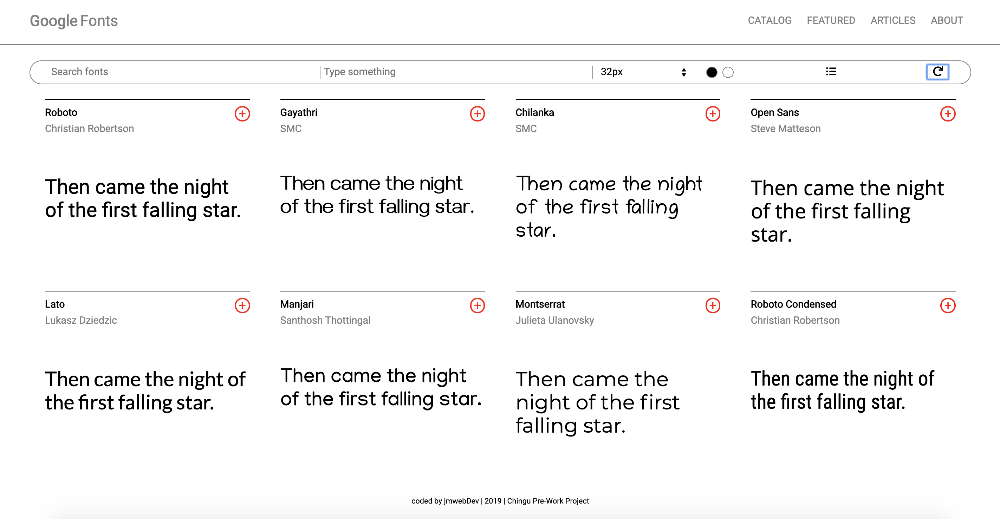

#Chingu Voyage Pre-Work Solo Project (Tier 1): *Favorite Fonts*#

##Overview##

This project is a great opportunity to develop a clean and modern webpage. The *Favorite Fonts* app will be completed accross tiers, with each tier adding a level of complexity. You are currently on the *Tier 1* repo. You'll be responsible for coding the **HTML**, **CSS**, and **JavaScript** to get the structure, styling, and some functionality up and running.

As you add skills to your developer toolbag you'll be able to come back to this project and add in the Tier 2 and Tier 3 features. Ultimately you'll have a great portfolio piece, and will have implement a number of common and in-demand features.

**No frameworks are allowed in this Tier, and no frameworks were used in the creation of the Tier 1 / Tier 2 / Tier 3 versions of the application's front-end.**

##Instructions##

Remember, this project must be completed with **vanilla** (plain) HTML, CSS, and JavaScript. Do not user front-end frameworks or libraries *(including JQuery and Bootstrap)*.

General instructions for all Pre-Work Projects can also be found in the Chingu Voyage Handbook (URL posted in the #read-me-first channel on Discord).

**Requirements**

*Structure*
- [] Header with minor navigation
- [] Major navigation / page-manipulation
- [] Main section for the font cards
- [] Font cards which display the Font Name, the creator, the sample text, and an add button
- [] Footer section with your developer information

*Style*
- [] Sample text in each card should be displayed in the corresponding font
- [] Buttons/links should be evident (make sure the cursor changes, etc.)
- [] Implement a way to handle overflow from sample text as the font size is adjustable

*Functionality*
- [] Text typed into the sample text (type something) box should immediately change the sample text in each font card
- [] The sample text should return to the default sample if the input box no longer has any input
- [] Font size chooser should have at least four sizes and should immediately change the sample text font size in each font card
- [] Implement the 'reset' icon on the far right of the major navigation; it should reset the sample text and font size

**Extras (Not Required)**

- [] Include a back-to-top button that allows users to scroll to the top if it is out of view
- [] Make your design fully responsive (small/large/portrait/landscape, etc.)
- [] Implement the light/dark mode toggle buttons
- [] Implement the change display icon so you can flip between a grid layout and a list layout for the font cards

##Example##

Here is a gif from the project website. The functionality shown includes the extra (not required) elements listed above.

